# Elementer

For UI automation, Page object management has always been a hassle. There are many libraries which help in externalizing the elements and their actions.

But what if there is a plugin that helps you build the page locators as you inspect elements in the browser? That would save most of your time and no dual work would be required.

Here, meet _Elementer_. The chrome extension which builds your element locator strategy.

### Pre-requisite
* Chrome browser - [link](https://www.google.com/chrome/)
* Elementer Plugin - [link](https://chrome.google.com/webstore/detail/elementer/conbkbehobncjfpbealkoobidhipknok?hl=en)

### Gist

Create, Edit & Update Page Element files using the plugin and export to JSON. This page file contains element name, locator entries across locale. It can be used by any page management library but we have tested with [SimpleSe](https://github.com/RationaleEmotions/SimpleSe).

### Creation

Let's take an example of a website with 3 page navigations from https://the-internet.herokuapp.com/login. 

1. Login
2. Home
3. Login (again)

By choice, you can maintain 2 pages separately and have the elements grouped under each page.

Now let's go through the journey with Elementer. Ensure [Pre-Requisite](#Pre-requisite) is met.

1. Open the website and open inspector. Select Elementer tab.

2. Add a new Page.

Click on hamburger icon, Create Page Object.
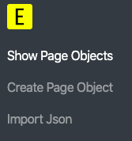

You will land in Add page screen. Enter _Page Name_, select default _Fallback Locale_ and click _Add Page Object_
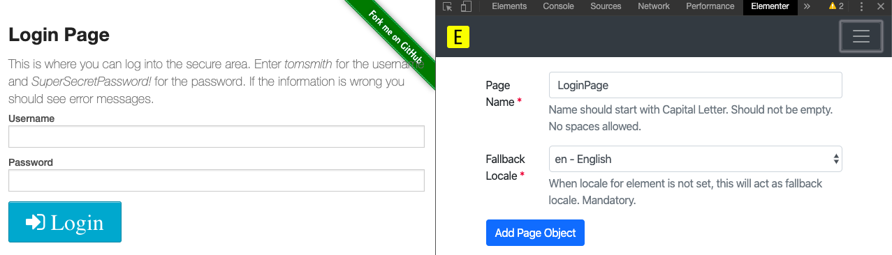

3. Add Element details

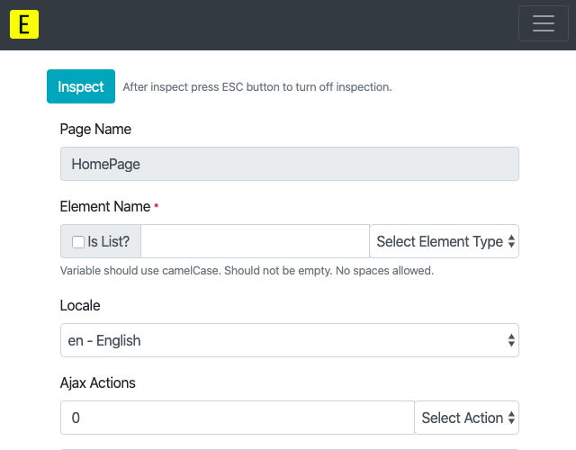

Enter element name and select element type
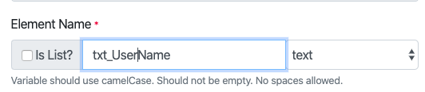

Click Inspect button on top and click on the relevant element in webpage.

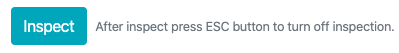

After inspection, select the valid locator strategy or modify any field.  
Select Ajax action (Visible/Clickable/Available) with wait duration.

Ajax actions are wait conditions in Selenium and this field can pick up wait strategy, duration from JSON to create custom Wait conditons.

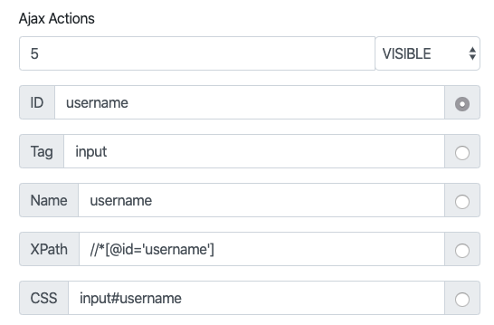

Finally, click Add Element button.

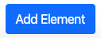

Now, go ahead and add other elements. In this case, we have added user name, password, login button elements. Enter credentials and navigate to next page.

4. Add Pages, Elements as per flow.

We have added Home Page. Under it, heading and Logout button elements are added.

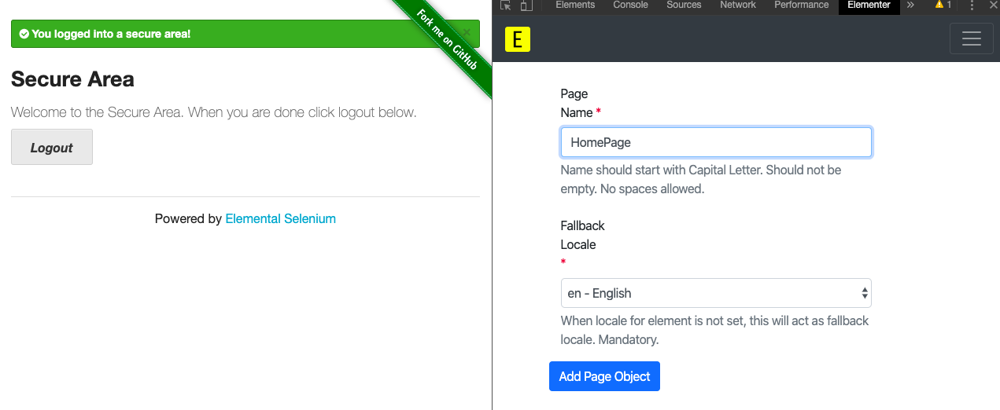

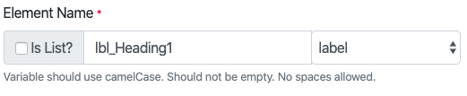

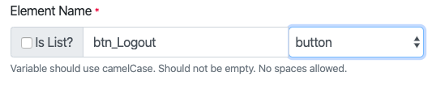

5. Edit Element/Page

If page or element details need to be edited, click on _Hamburger icon_ on top, select _Show Page Objects_. The list of pages will be displayed.
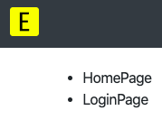

If JSON files from machine needs to be edited, Click on hamburger icon, _Import Json_.

Click Browse and select the JSON file.

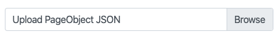

Click on _Import Page Object_ to update it.

Click on relevant page.
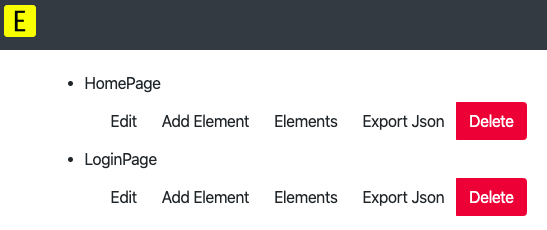

Here, we can edit page/add element/export JSON.

Assuming, we have to edit an existing element, click on _Elements_ 

Click on relevant element.
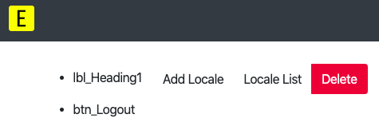

If a new locale is to be added for the same element, click on _Add Locale_. Or if existing locale needs an update, click on _Locale List_ and click respective _Locale_, _Edit_ button.

Locales are helpful when a single element may have different attributes based on Locale. Each Page will have default locale and each element will have a list of locales with locators.

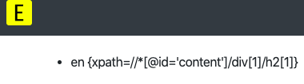

Upon updates, click on _Update Element_ button.

6. Export Page JSON

Click on _Hamburger icon_ on top, select _Show Page Objects_. The list of pages will be displayed.

Click on each page and click on _Export Json_ button.

This will download the JSON files to the machine.

These files are self explanatory and any Json parser can be written to extract values.

In [SimpleSe](https://github.com/RationaleEmotions/SimpleSe) terms, ideally the JSON files are placed under 
`src/test/resources/` folder.

### _Now go ahead and build Page Elements with ease using Elementer._